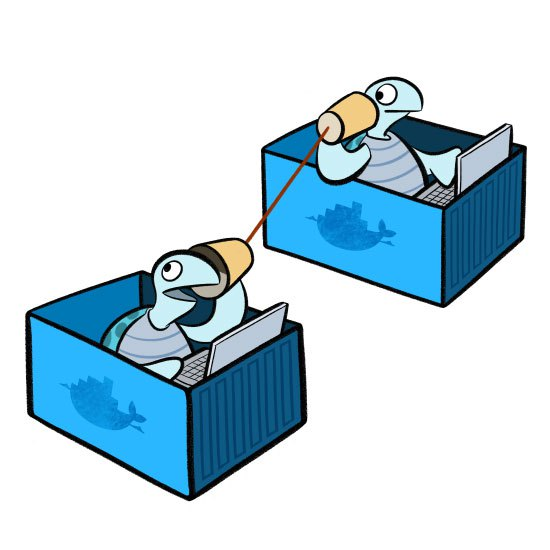

Basic Network
=============

Image reference from [#f1]_

When you install Docker, it creates three networks automatically. You can list these networks using the docker network ls command:

.. code-block:: bash

  $ docker network ls
  NETWORK ID          NAME                DRIVER
  32b93b141bae        bridge              bridge
  c363d9a92877        host                host
  88077db743a8        none                null

Bridge Network
---------------

The bridge network represents the docker0 network present in all Docker installations. Unless you specify otherwise with
the docker run --network=<NETWORK> option, the Docker daemon connects containers to this network by default.
You can see this bridge as part of a host’s network stack by using the ifconfig/ip command on the host [#f2]_.

.. code-block:: bash

  $ ip link
  1: lo: <LOOPBACK,UP,LOWER_UP> mtu 65536 qdisc noqueue state UNKNOWN mode DEFAULT
      link/loopback 00:00:00:00:00:00 brd 00:00:00:00:00:00
  2: eth0: <BROADCAST,MULTICAST,UP,LOWER_UP> mtu 9001 qdisc pfifo_fast state UP mode DEFAULT qlen 1000
      link/ether 06:95:4a:1f:08:7f brd ff:ff:ff:ff:ff:ff
  3: docker0: <NO-CARRIER,BROADCAST,MULTICAST,UP> mtu 1500 qdisc noqueue state DOWN mode DEFAULT
      link/ether 02:42:d6:23:e6:18 brd ff:ff:ff:ff:ff:ff

Because there are no containers running, the bridge `docker0` status is down. Now we create and run a centos7 container:

.. code-block:: bash

  $ docker run -d --name test1 centos:7 /bin/bash -c "while true; do sleep 3600; done"
  $ docker ps
  CONTAINER ID        IMAGE               COMMAND                  CREATED             STATUS              PORTS               NAMES
  8b9d9c48a8d1        centos:7            "/bin/bash -c 'while "   6 minutes ago       Up 6 minutes                            test1

After that we can check the ip interface in the docker host.

.. code-block:: bash

  $ ip li
  1: lo: <LOOPBACK,UP,LOWER_UP> mtu 65536 qdisc noqueue state UNKNOWN mode DEFAULT
      link/loopback 00:00:00:00:00:00 brd 00:00:00:00:00:00
  2: eth0: <BROADCAST,MULTICAST,UP,LOWER_UP> mtu 9001 qdisc pfifo_fast state UP mode DEFAULT qlen 1000
      link/ether 06:95:4a:1f:08:7f brd ff:ff:ff:ff:ff:ff
  3: docker0: <BROADCAST,MULTICAST,UP,LOWER_UP> mtu 1500 qdisc noqueue state UP mode DEFAULT
      link/ether 02:42:d6:23:e6:18 brd ff:ff:ff:ff:ff:ff
  15: vethae2abb8@if14: <BROADCAST,MULTICAST,UP,LOWER_UP> mtu 1500 qdisc noqueue master docker0 state UP mode DEFAULT
      link/ether e6:97:43:5c:33:a6 brd ff:ff:ff:ff:ff:ff link-netnsid 0

The bridge `dockero` is up, and there is a

Host Network
------------

.. rubric:: Reference

.. [#f1] https://blog.docker.com/2015/04/docker-networking-takes-a-step-in-the-right-direction-2/
.. [#f2] https://docs.docker.com/engine/userguide/networking/
