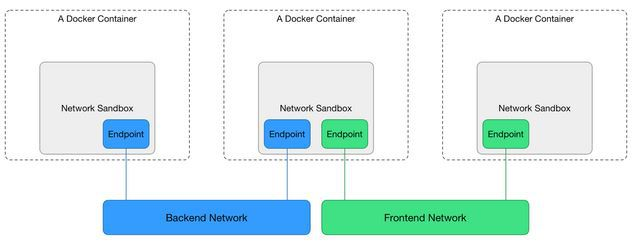

Bridge Networking Deep Dive
===========================

The bridge network represents the docker0 network present in all Docker installations. Unless you specify otherwise with
the ``docker run --network=<NETWORK> option``, the Docker daemon connects containers to this network by default.

There are four important concepts about bridged networking:

- Docker0 Bridge
- Network Namespace
- Veth Pair
- External Communication

Docker0 bridge
--------------

Docker version for this lab:

.. code-block:: bash

  $ docker version
  Client:
   Version:      1.11.2
   API version:  1.23
   Go version:   go1.5.4
   Git commit:   b9f10c9
   Built:        Wed Jun  1 21:23:11 2016
   OS/Arch:      linux/amd64

  Server:
   Version:      1.11.2
   API version:  1.23
   Go version:   go1.5.4
   Git commit:   b9f10c9
   Built:        Wed Jun  1 21:23:11 2016
   OS/Arch:      linux/amd64

Through ``docker network`` command we can get more details about the docker0 bridge, and from the output, we can see there is no Container
connected with the bridge now.

.. code-block:: bash

  $ docker network ls
  NETWORK ID          NAME                DRIVER
  32b93b141bae        bridge              bridge
  c363d9a92877        host                host
  88077db743a8        none                null

.. code-block:: bash

  $ docker network inspect 32b93b141bae
  [
      {
          "Name": "bridge",
          "Id": "32b93b141baeeac8bbf01382ec594c23515719c0d13febd8583553d70b4ecdba",
          "Scope": "local",
          "Driver": "bridge",
          "EnableIPv6": false,
          "IPAM": {
              "Driver": "default",
              "Options": null,
              "Config": [
                  {
                      "Subnet": "172.17.0.0/16",
                      "Gateway": "172.17.0.1"
                  }
              ]
          },
          "Internal": false,
          "Containers": {},
          "Options": {
              "com.docker.network.bridge.default_bridge": "true",
              "com.docker.network.bridge.enable_icc": "true",
              "com.docker.network.bridge.enable_ip_masquerade": "true",
              "com.docker.network.bridge.host_binding_ipv4": "0.0.0.0",
              "com.docker.network.bridge.name": "docker0",
              "com.docker.network.driver.mtu": "1500"
          },
          "Labels": {}
      }
  ]

You can also see this bridge as a part of a host’s network stack by using the ifconfig/ip command on the host.

.. code-block:: bash

  $ ip link
  1: lo: <LOOPBACK,UP,LOWER_UP> mtu 65536 qdisc noqueue state UNKNOWN mode DEFAULT
      link/loopback 00:00:00:00:00:00 brd 00:00:00:00:00:00
  2: eth0: <BROADCAST,MULTICAST,UP,LOWER_UP> mtu 9001 qdisc pfifo_fast state UP mode DEFAULT qlen 1000
      link/ether 06:95:4a:1f:08:7f brd ff:ff:ff:ff:ff:ff
  3: docker0: <NO-CARRIER,BROADCAST,MULTICAST,UP> mtu 1500 qdisc noqueue state DOWN mode DEFAULT
      link/ether 02:42:d6:23:e6:18 brd ff:ff:ff:ff:ff:ff

Because there are no containers running, the bridge ``docker0`` status is down.

You can also use ``brctl`` command to get bridge docker0 information

.. code-block:: bash

  $ brctl show
  bridge name     bridge id               STP enabled     interfaces
  docker0         8000.0242d623e618       no              veth6a5ae6f

.. note::

  If you can't find ``brctl`` command, you can install it. For CentOS, please use ``sudo yum install bridge-utils``. For Ubuntu,
  please use ``apt-get install bridge-utils``

Veth Pair
---------

Now we create and run a centos7 container:

.. code-block:: bash

  $ docker run -d --name test1 centos:7 /bin/bash -c "while true; do sleep 3600; done"
  $ docker ps
  CONTAINER ID        IMAGE               COMMAND                  CREATED             STATUS              PORTS               NAMES
  4fea95f2e979        centos:7            "/bin/bash -c 'while "   6 minutes ago       Up 6 minutes                            test1

After that we can check the ip interface in the docker host.

.. code-block:: bash

  $ ip li
  1: lo: <LOOPBACK,UP,LOWER_UP> mtu 65536 qdisc noqueue state UNKNOWN mode DEFAULT
      link/loopback 00:00:00:00:00:00 brd 00:00:00:00:00:00
  2: eth0: <BROADCAST,MULTICAST,UP,LOWER_UP> mtu 9001 qdisc pfifo_fast state UP mode DEFAULT qlen 1000
      link/ether 06:95:4a:1f:08:7f brd ff:ff:ff:ff:ff:ff
  3: docker0: <BROADCAST,MULTICAST,UP,LOWER_UP> mtu 1500 qdisc noqueue state UP mode DEFAULT
      link/ether 02:42:d6:23:e6:18 brd ff:ff:ff:ff:ff:ff
  15: vethae2abb8@if14: <BROADCAST,MULTICAST,UP,LOWER_UP> mtu 1500 qdisc noqueue master docker0 state UP mode DEFAULT
      link/ether e6:97:43:5c:33:a6 brd ff:ff:ff:ff:ff:ff link-netnsid 0

The bridge ``docker0`` is up, and there is a veth pair created, one is in localhost, and another is in container's network namspace.

Network Namespace
------------------

If we add a new network namespace from command line.

.. code-block:: bash

  $ sudo ip netns add demo
  $ ip netns list
  demo
  $ ls /var/run/netns
  demo
  $ sudo ip netns exec demo ip a
  1: lo: <LOOPBACK> mtu 65536 qdisc noop state DOWN
      link/loopback 00:00:00:00:00:00 brd 00:00:00:00:00:00

But from the command ``ip netns list``, we can't get the container's network namespace. The reason is because docker deleted all containers network namespaces information from ``/var/run/netns``.

We can get all docker container network namespace from ``/var/run/docker/netns``.

.. code-block:: bash

  $ docker ps -a
  CONTAINER ID        IMAGE               COMMAND                  CREATED             STATUS              PORTS               NAMES
  4fea95f2e979        centos:7            "/bin/bash -c 'while "   2 hours ago         Up About an hour                        test1
  $ sudo ls -l /var/run/docker/netns
  total 0
  -rw-r--r--. 1 root root 0 Nov 28 05:51 572d8e7abcb2

How to get the detail information (like veth) about the container network namespace?

First we should get the pid of this container process, and get all namespaces about this container.

.. code-block:: bash

  $ docker ps
  CONTAINER ID        IMAGE               COMMAND                  CREATED             STATUS              PORTS               NAMES
  4fea95f2e979        centos:7            "/bin/bash -c 'while "   2 hours ago         Up 2 hours                              test1
  $ docker inspect --format '{{.State.Pid}}' 4f
  3090
  $ sudo ls -l /proc/3090/ns
  total 0
  lrwxrwxrwx. 1 root root 0 Nov 28 05:52 ipc -> ipc:[4026532156]
  lrwxrwxrwx. 1 root root 0 Nov 28 05:52 mnt -> mnt:[4026532154]
  lrwxrwxrwx. 1 root root 0 Nov 28 05:51 net -> net:[4026532159]
  lrwxrwxrwx. 1 root root 0 Nov 28 05:52 pid -> pid:[4026532157]
  lrwxrwxrwx. 1 root root 0 Nov 28 08:02 user -> user:[4026531837]
  lrwxrwxrwx. 1 root root 0 Nov 28 05:52 uts -> uts:[4026532155]

Then restore the network namespace:

.. code-block:: bash

  $ sudo ln -s /proc/3090/ns/net /var/run/netns/3090
  $ ip netns list
  3090
  demo
  $ sudo ip netns exec 3090 ip link
  1: lo: <LOOPBACK,UP,LOWER_UP> mtu 65536 qdisc noqueue state UNKNOWN mode DEFAULT
      link/loopback 00:00:00:00:00:00 brd 00:00:00:00:00:00
  26: eth0@if27: <BROADCAST,MULTICAST,UP,LOWER_UP> mtu 1500 qdisc noqueue state UP mode DEFAULT
      link/ether 02:42:ac:11:00:02 brd ff:ff:ff:ff:ff:ff link-netnsid 0

After all is done, please remove ``/var/run/netns/3090``.

External Communication
----------------------

All containers connected with bridge ``docker0`` can communicate with the external network or other containers which
connected with the same bridge.

Let's start two containers:

.. code-block:: bash

  $ docker run -d --name test2 centos:7 /bin/bash -c "while true; do sleep 3600; done"
  8975cb01d142271d463ec8dac43ea7586f509735d4648203319d28d46365af2f
  $ docker ps
  CONTAINER ID        IMAGE               COMMAND                  CREATED             STATUS              PORTS               NAMES
  8975cb01d142        centos:7            "/bin/bash -c 'while "   4 seconds ago       Up 4 seconds                            test2
  4fea95f2e979        centos:7            "/bin/bash -c 'while "   27 hours ago        Up 26 hours                             test1

And from the bridge ``docker0``, we can see two interfaces connected.

.. code-block:: bash

  $ brctl show
  bridge name     bridge id               STP enabled     interfaces
  docker0         8000.0242d623e618       no              veth6a5ae6f
                                                          vethc16e6c8
  $ ip link
  1: lo: <LOOPBACK,UP,LOWER_UP> mtu 65536 qdisc noqueue state UNKNOWN mode DEFAULT
      link/loopback 00:00:00:00:00:00 brd 00:00:00:00:00:00
  2: eth0: <BROADCAST,MULTICAST,UP,LOWER_UP> mtu 9001 qdisc pfifo_fast state UP mode DEFAULT qlen 1000
      link/ether 06:95:4a:1f:08:7f brd ff:ff:ff:ff:ff:ff
  3: docker0: <BROADCAST,MULTICAST,UP,LOWER_UP> mtu 1500 qdisc noqueue state UP mode DEFAULT
      link/ether 02:42:d6:23:e6:18 brd ff:ff:ff:ff:ff:ff
  27: veth6a5ae6f@if26: <BROADCAST,MULTICAST,UP,LOWER_UP> mtu 1500 qdisc noqueue master docker0 state UP mode DEFAULT
      link/ether 02:7d:eb:4e:85:99 brd ff:ff:ff:ff:ff:ff link-netnsid 0
  31: vethc16e6c8@if30: <BROADCAST,MULTICAST,UP,LOWER_UP> mtu 1500 qdisc noqueue master docker0 state UP mode DEFAULT
      link/ether d2:9f:2e:ca:22:a5 brd ff:ff:ff:ff:ff:ff link-netnsid 1

The two containers can be reached by each other

.. code-block:: bash

  $  docker inspect --format '{{.NetworkSettings.IPAddress}}' test1
  172.17.0.2
  $  docker inspect --format '{{.NetworkSettings.IPAddress}}' test2
  172.17.0.3
  $ docker exec test1 bash -c 'ping 172.17.0.3'
  PING 172.17.0.3 (172.17.0.3) 56(84) bytes of data.
  64 bytes from 172.17.0.3: icmp_seq=1 ttl=64 time=0.051 ms
  64 bytes from 172.17.0.3: icmp_seq=2 ttl=64 time=0.058 ms
  64 bytes from 172.17.0.3: icmp_seq=3 ttl=64 time=0.053 ms
  ^C

The basic network would be like below:

.. image:: _image/two-container-network.png

CNM
~~~~

To understand how container get its ip address, you should understand what is CNM (Container Network Model) [#f2]_.

Libnetwork implements Container Network Model (CNM) which formalizes the steps required to provide networking for
containers while providing an abstraction that can be used to support multiple network drivers.

During the Network and Endpoints lifecycle, the CNM model controls the IP address assignment for network
and endpoint interfaces via the IPAM driver(s) [#f1]_.

When creating the bridge ``docker0``,  libnetwork will do some request to IPAM driver, something like network gateway, address
pool. When creating a container, in the network sandbox, and endpoint was created, libnetwork will request an IPv4 address from
the IPv4 pool and assign it to the endpoint interface IPv4 address.

NAT
~~~

Container in bridge network mode can access the external network through ``NAT`` which configured by ``iptables``.

Inside the container:

.. code-block:: bash

  # ping www.google.com
  PING www.google.com (172.217.27.100) 56(84) bytes of data.
  64 bytes from sin11s04-in-f4.1e100.net (172.217.27.100): icmp_seq=1 ttl=61 time=99.0 ms
  64 bytes from sin11s04-in-f4.1e100.net (172.217.27.100): icmp_seq=2 ttl=61 time=108 ms
  64 bytes from sin11s04-in-f4.1e100.net (172.217.27.100): icmp_seq=3 ttl=61 time=110 ms
  ^C
  --- www.google.com ping statistics ---
  3 packets transmitted, 3 received, 0% packet loss, time 2004ms
  rtt min/avg/max/mdev = 99.073/106.064/110.400/4.990 ms

From the docker host, we can see:

.. code-block:: bash

  $ sudo iptables --list -t nat
  Chain PREROUTING (policy ACCEPT)
  target     prot opt source               destination
  DOCKER     all  --  anywhere             anywhere             ADDRTYPE match dst-type LOCAL

  Chain INPUT (policy ACCEPT)
  target     prot opt source               destination

  Chain OUTPUT (policy ACCEPT)
  target     prot opt source               destination
  DOCKER     all  --  anywhere            !loopback/8           ADDRTYPE match dst-type LOCAL

  Chain POSTROUTING (policy ACCEPT)
  target     prot opt source               destination
  MASQUERADE  all  --  172.17.0.0/16  anywhere

  Chain DOCKER (2 references)
  target     prot opt source               destination
  RETURN     all  --  anywhere             anywhere

For NAT with iptables, you can reference [#f3]_ [#f4]_

Reference
----------

.. [#f1] https://github.com/docker/libnetwork/blob/master/docs/ipam.md
.. [#f2] https://github.com/docker/libnetwork/blob/master/docs/design.md
.. [#f3] http://www.karlrupp.net/en/computer/nat_tutorial
.. [#f4] https://access.redhat.com/documentation/en-US/Red_Hat_Enterprise_Linux/4/html/Security_Guide/s1-firewall-ipt-fwd.html
