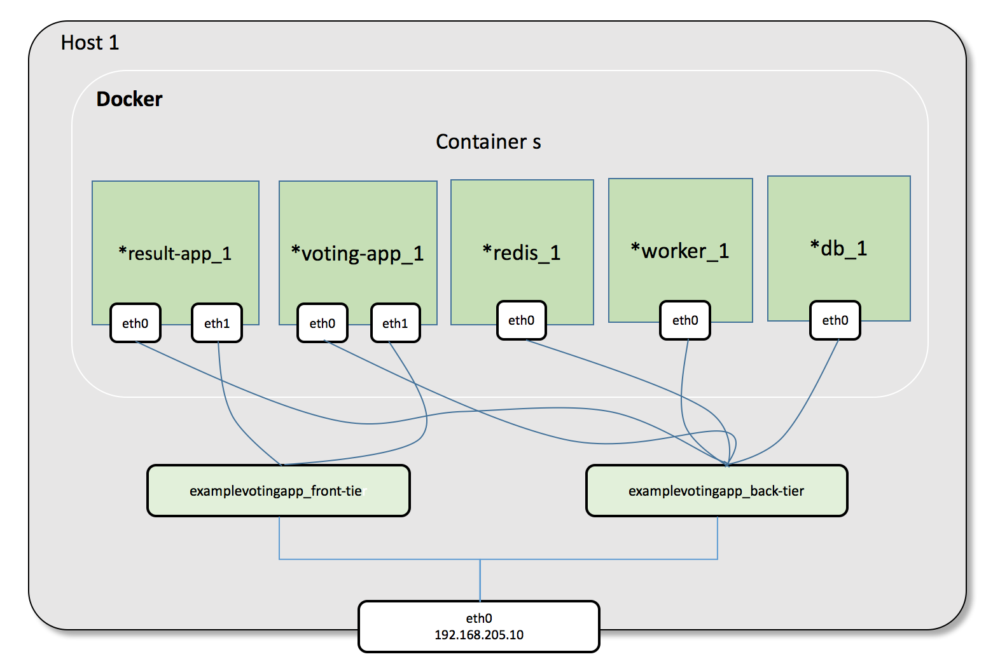

Docker Compose Networking Deep Dive
===================================

.. note::

  We suggest that you should complete the lab :doc:`bridged-network` firstly before going to this lab.

This lab will use ``example-voting-app`` as the demo application run by docker-compose, you can find the source code of the project in
https://github.com/DaoCloud/example-voting-app

Using Compose is basically a three-step process. [#f1]_

1. Define your app’s environment with a Dockerfile so it can be reproduced anywhere.
2. Define the services that make up your app in docker-compose.yml so they can be run together in an isolated environment.
3. Lastly, run docker-compose up and Compose will start and run your entire app.

For ``example-voting-app``, we already have ``Dockerfile`` and ``docker-compose.yml``, what need to do is ``docker-compose up``.

Install Docker Compose
----------------------

There are many ways to install docker compose [#f2]_.

In our one node docker engine lab environment :doc:`../lab-environment`
we install docker compose as the following way in one docker host.

.. code-block:: bash

  ubuntu@docker-node1:~$ sudo curl -L "https://github.com/docker/compose/releases/download/1.9.0/docker-compose-$(uname -s)-$(uname -m)" -o /usr/local/bin/docker-compose
  ubuntu@docker-node1:~$ sudo chmod +x /usr/local/bin/docker-compose
  ubuntu@docker-node1:~$ docker-compose -v
  docker-compose version 1.9.0, build 2585387

Start APP
----------

Clone ``example-voting-app`` repository to docker host, it defined five containers: ``voting-app``, ``result-app``, ``worker``, ``redis``, ``db``.
and two networks: ``front-tier``, ``back-tier`` through ``docker-compose.yml``.

.. code-block:: bash

  version: "2"

  services:
    voting-app:
      build: ./voting-app/.
      volumes:
       - ./voting-app:/app
      ports:
        - "5000:80"
      links:
        - redis
      networks:
        - front-tier
        - back-tier

    result-app:
      build: ./result-app/.
      volumes:
        - ./result-app:/app
      ports:
        - "5001:80"
      links:
        - db
      networks:
        - front-tier
        - back-tier

    worker:
      build: ./worker
      links:
        - db
        - redis
      networks:
        - back-tier

    redis:
      image: redis
      ports: ["6379"]
      networks:
        - back-tier

    db:
      image: postgres:9.4
      volumes:
        - "db-data:/var/lib/postgresql/data"
      networks:
        - back-tier

  volumes:
    db-data:

  networks:
    front-tier:
    back-tier:

Then run ``docker-compose build`` to build required docker images. This will take some time.

.. code-block:: bash

  ubuntu@docker-node1:~$ git clone https://github.com/DaoCloud/example-voting-app
  ubuntu@docker-node1:~$ cd example-voting-app/
  ubuntu@docker-node1:~/example-voting-app$ sudo docker-compose build

  ubuntu@docker-node1:~/example-voting-app$ sudo docker-compose up
  Creating network "examplevotingapp_front-tier" with the default driver
  Creating network "examplevotingapp_back-tier" with the default driver
  Creating volume "examplevotingapp_db-data" with default driver
  ....
  Creating examplevotingapp_db_1
  Creating examplevotingapp_redis_1
  Creating examplevotingapp_voting-app_1
  Creating examplevotingapp_result-app_1
  Creating examplevotingapp_worker_1
  Attaching to examplevotingapp_redis_1, examplevotingapp_db_1, examplevotingapp_result-app_1, examplevotingapp_voting-app_1, examplevotingapp_worker_1
  ...

There will be five containers, two bridge networks and seven veth interfaces created.

.. code-block:: bash

  ubuntu@docker-node1:~/example-voting-app$ sudo docker ps
  CONTAINER ID        IMAGE                         COMMAND                  CREATED             STATUS              PORTS                     NAMES
  c9c4e7fe7b6c        examplevotingapp_worker       "/usr/lib/jvm/java-7-"   About an hour ago   Up 5 seconds                                  examplevotingapp_worker_1
  4213167049aa        examplevotingapp_result-app   "node server.js"         About an hour ago   Up 4 seconds        0.0.0.0:5001->80/tcp      examplevotingapp_result-app_1
  8711d687bda9        examplevotingapp_voting-app   "python app.py"          About an hour ago   Up 5 seconds        0.0.0.0:5000->80/tcp      examplevotingapp_voting-app_1
  b7eda251865d        redis                         "docker-entrypoint.sh"   About an hour ago   Up 5 seconds        0.0.0.0:32770->6379/tcp   examplevotingapp_redis_1
  7d6dbb98ce40        postgres:9.4                  "/docker-entrypoint.s"   About an hour ago   Up 5 seconds        5432/tcp                  examplevotingapp_db_1
  ubuntu@docker-node1:~/example-voting-app$ sudo docker network ls
  NETWORK ID          NAME                          DRIVER              SCOPE
  3b5cfe4aafa1        bridge                        bridge              local
  69a019d00603        examplevotingapp_back-tier    bridge              local
  6ddb07377c35        examplevotingapp_front-tier   bridge              local
  b1670e00e2a3        host                          host                local
  6006af29f010        none                          null                local
  ubuntu@docker-node1:~/example-voting-app$ brctl show
  bridge name	bridge id		STP enabled	interfaces
  br-69a019d00603		8000.0242c780244f	no		veth2eccb94
  							veth374be12
  							veth57f50a8
  							veth8418ed3
  							veth91d724d
  br-6ddb07377c35		8000.02421dac7490	no		veth156c0a9
  							vethaba6401

Through ``docker network inspect``, we can know which container connnect with the bridge.

There are two containers connect with docker network ``examplevotingapp_front-tier``.

.. code-block:: bash

  ubuntu@docker-node1:~/example-voting-app$ sudo docker network inspect examplevotingapp_front-tier
  [
      {
          "Name": "examplevotingapp_front-tier",
          "Id": "6ddb07377c354bcf68542592a8c6eb34d334ce8515e64832b3c7bf2af56274ca",
          "Scope": "local",
          "Driver": "bridge",
          "EnableIPv6": false,
          "IPAM": {
              "Driver": "default",
              "Options": null,
              "Config": [
                  {
                      "Subnet": "172.18.0.0/16",
                      "Gateway": "172.18.0.1/16"
                  }
              ]
          },
          "Internal": false,
          "Containers": {
              "4213167049aa7b2cc1b3096333706f2ef0428e78b2847a7c5ddc755f5332505c": {
                  "Name": "examplevotingapp_result-app_1",
                  "EndpointID": "00c7e1101227ece1535385e8d6fe9210dfcdc3c58d71cedb4e9fad6c949120e3",
                  "MacAddress": "02:42:ac:12:00:03",
                  "IPv4Address": "172.18.0.3/16",
                  "IPv6Address": ""
              },
              "8711d687bda94069ed7d5a7677ca4c7953d384f1ebf83c3bd75ac51b1606ed2f": {
                  "Name": "examplevotingapp_voting-app_1",
                  "EndpointID": "ffc9905cbfd5332b9ef333bcc7578415977a0044c2ec2055d6760c419513ae5f",
                  "MacAddress": "02:42:ac:12:00:02",
                  "IPv4Address": "172.18.0.2/16",
                  "IPv6Address": ""
              }
          },
          "Options": {},
          "Labels": {}
      }
  ]

There are five containers connect with docker network ``examplevotingapp_back-tier``.

.. code-block:: bash

  ubuntu@docker-node1:~/example-voting-app$ sudo docker network inspect examplevotingapp_back-tier
  [
      {
          "Name": "examplevotingapp_back-tier",
          "Id": "69a019d00603ca3a06a30ac99fc0a2700dd8cc14ba8b8368de4fe0c26ad4c69d",
          "Scope": "local",
          "Driver": "bridge",
          "EnableIPv6": false,
          "IPAM": {
              "Driver": "default",
              "Options": null,
              "Config": [
                  {
                      "Subnet": "172.19.0.0/16",
                      "Gateway": "172.19.0.1/16"
                  }
              ]
          },
          "Internal": false,
          "Containers": {
              "4213167049aa7b2cc1b3096333706f2ef0428e78b2847a7c5ddc755f5332505c": {
                  "Name": "examplevotingapp_result-app_1",
                  "EndpointID": "cb531eb6deb08346d1dbcfa65ea67d43d4c2f244f002b195fc4dadd2adb0b47d",
                  "MacAddress": "02:42:ac:13:00:06",
                  "IPv4Address": "172.19.0.6/16",
                  "IPv6Address": ""
              },
              "7d6dbb98ce408c1837f42fdf743e365cc9b0ee2b7dffd108d97e81b172d43114": {
                  "Name": "examplevotingapp_db_1",
                  "EndpointID": "67007a454f320d336c13e30e028cd8e85537400b70a880eabdd1f0ed743b7a6a",
                  "MacAddress": "02:42:ac:13:00:03",
                  "IPv4Address": "172.19.0.3/16",
                  "IPv6Address": ""
              },
              "8711d687bda94069ed7d5a7677ca4c7953d384f1ebf83c3bd75ac51b1606ed2f": {
                  "Name": "examplevotingapp_voting-app_1",
                  "EndpointID": "d414b06b9368d1719a05d527500a06fc714a4efae187df32c1476385ee03ae67",
                  "MacAddress": "02:42:ac:13:00:05",
                  "IPv4Address": "172.19.0.5/16",
                  "IPv6Address": ""
              },
              "b7eda251865d824de90ebe0dfefa3e4aab924d5030ccfb21a55e79f910ff857a": {
                  "Name": "examplevotingapp_redis_1",
                  "EndpointID": "9acc267d3e6b41da6fe3db040cff964c91037df215a0f2be2155b94be3bb87d0",
                  "MacAddress": "02:42:ac:13:00:02",
                  "IPv4Address": "172.19.0.2/16",
                  "IPv6Address": ""
              },
              "c9c4e7fe7b6c1508f9d9d3a05e8a4e66aa1265f2a5c3d33f363343cd37184e6f": {
                  "Name": "examplevotingapp_worker_1",
                  "EndpointID": "557e978eaef18a64f24d400727d396431d74cd7e8735f060396e3226f31ab97b",
                  "MacAddress": "02:42:ac:13:00:04",
                  "IPv4Address": "172.19.0.4/16",
                  "IPv6Address": ""
              }
          },
          "Options": {},
          "Labels": {}
      }
  ]

Container information summary:

==============================  ============================
Container Name                  IP Address
==============================  ============================
examplevotingapp_result-app_1   172.19.0.6/16, 172.18.0.3/16
examplevotingapp_voting-app_1   172.19.0.3/16, 172.18.0.2/16
examplevotingapp_redis_1        172.19.0.2/16
examplevotingapp_worker_1       172.19.0.4/16
examplevotingapp_db_1           172.19.0.3/16
==============================  ============================

Docker network information summary:

==============================  ============= ============= =========================================================================================================================================
Docker Network Name             Gateway       Subnet        Containers
==============================  ============= ============= =========================================================================================================================================
examplevotingapp_front-tier     172.18.0.1/16 172.18.0.0/16 examplevotingapp_result-app_1, examplevotingapp_voting-app_1
examplevotingapp_back-tier      172.19.0.1/16 172.19.0.0/16 examplevotingapp_result-app_1, examplevotingapp_voting-app_1, examplevotingapp_db_1, examplevotingapp_redis_1, examplevotingapp_worker_1
==============================  ============= ============= =========================================================================================================================================

Network Topology
-----------------

For bridge network connection details, please reference lab :doc:`bridged-network`

Reference
---------

.. [#f1] https://docs.docker.com/compose/overview/
.. [#f2] https://docs.docker.com/compose/install/
