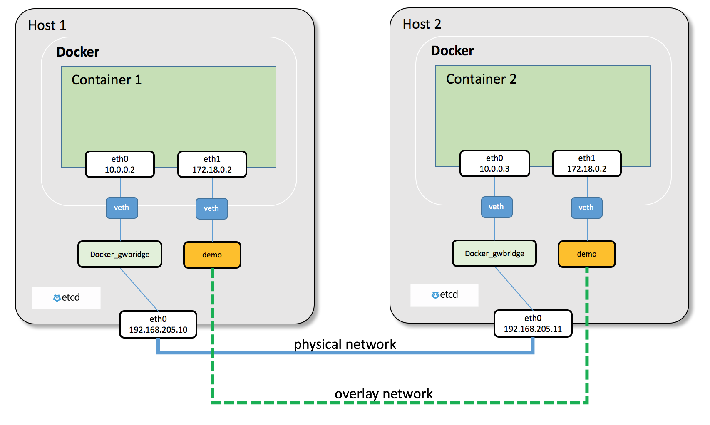

Multi-Host Overlay Networking with Etcd
=======================================

Docker has a build-in overlay networking driver, and it is used by default when docker running in swarm mode [#f1]_.

.. note::

  The Docker Overlay driver has existed since Docker Engine 1.9, and an external K/V store was required to manage state for the network. Docker Engine 1.12 integrated the control plane state into Docker Engine so that an external store is no longer required. 1.12 also introduced several new features including encryption and service load balancing. Networking features that are introduced require a Docker Engine version that supports them, and using these features with older versions of Docker Engine is not supported.

This lab we will not run docker in swarm mode, but use docker engine with external key-value store to do multi-host
overlay networking.

We chose etcd [#f2]_ as our external key-value store. You can trade etcd cluster as the management plane in this multi-host
networking.

For data plane, The Docker overlay network encapsulates container traffic in a VXLAN header which allows the traffic to traverse the physical Layer 2 or Layer 3 network.

.. note::

  VXLAN has been a part of the Linux kernel since version 3.7, and Docker uses the native VXLAN features of the kernel to create overlay networks. The Docker overlay datapath is entirely in kernel space. This results in fewer context switches, less CPU overhead, and a low-latency, direct traffic path between applications and the physical NIC.

Prepare Environment
--------------------

Create a ``etcd`` two node cluster [#f3]_. On docker-node1:

.. code-block:: bash

  ubuntu@docker-node1:~$ wget https://github.com/coreos/etcd/releases/download/v3.0.12/etcd-v3.0.12-linux-amd64.tar.gz
  ubuntu@docker-node1:~$ tar zxvf etcd-v3.0.12-linux-amd64.tar.gz
  ubuntu@docker-node1:~$ cd etcd-v3.0.12-linux-amd64
  ubuntu@docker-node1:~$ nohup ./etcd --name docker-node1 --initial-advertise-peer-urls http://192.168.205.10:2380 \
  --listen-peer-urls http://192.168.205.10:2380 \
  --listen-client-urls http://192.168.205.10:2379,http://127.0.0.1:2379 \
  --advertise-client-urls http://192.168.205.10:2379 \
  --initial-cluster-token etcd-cluster \
  --initial-cluster docker-node1=http://192.168.205.10:2380,docker-node2=http://192.168.205.11:2380 \
  --initial-cluster-state new&

On docker-node2, start etcd and check cluster status through cmd ``./etcdctl cluster-health``.

.. code-block:: bash

  ubuntu@docker-node2:~$ wget https://github.com/coreos/etcd/releases/download/v3.0.12/etcd-v3.0.12-linux-amd64.tar.gz
  ubuntu@docker-node2:~$ tar zxvf etcd-v3.0.12-linux-amd64.tar.gz
  ubuntu@docker-node2:~$ cd etcd-v3.0.12-linux-amd64/
  ubuntu@docker-node2:~$ nohup ./etcd --name docker-node2 --initial-advertise-peer-urls http://192.168.205.11:2380 \
  --listen-peer-urls http://192.168.205.11:2380 \
  --listen-client-urls http://192.168.205.11:2379,http://127.0.0.1:2379 \
  --advertise-client-urls http://192.168.205.11:2379 \
  --initial-cluster-token etcd-cluster \
  --initial-cluster docker-node1=http://192.168.205.10:2380,docker-node2=http://192.168.205.11:2380 \
  --initial-cluster-state new&
  ubuntu@docker-node2:~/etcd-v3.0.12-linux-amd64$ ./etcdctl cluster-health
  member 21eca106efe4caee is healthy: got healthy result from http://192.168.205.10:2379
  member 8614974c83d1cc6d is healthy: got healthy result from http://192.168.205.11:2379
  cluster is healthy

Restart docker engine with cluster configuration
------------------------------------------------

on docker-node1

if docker version < 17.09

.. code-block:: bash

  ubuntu@docker-node1:~$ sudo service docker stop
  ubuntu@docker-node1:~$ sudo /usr/bin/docker daemon -H tcp://0.0.0.0:2375 -H unix:///var/run/docker.sock --cluster-store=etcd://192.168.205.10:2379 --cluster-advertise=192.168.205.10:2375

if docker version >= 17.09

.. code-block:: bash

  ubuntu@docker-node1:~$ sudo service docker stop
  ubuntu@docker-node1:~$ sudo /usr/bin/dockerd  -H tcp://0.0.0.0:2375 -H unix:///var/run/docker.sock --cluster-store=etcd://192.168.205.10:2379 --cluster-advertise=192.168.205.10:2375

On docker-node2

.. code-block:: bash

  ubuntu@docker-node2:~$ sudo service docker stop
  ubuntu@docker-node2:~$ sudo /usr/bin/docker daemon -H tcp://0.0.0.0:2375 -H unix:///var/run/docker.sock --cluster-store=etcd://192.168.205.11:2379 --cluster-advertise=192.168.205.11:2375

Create Overlay Network
-----------------------

On docker-node1, we create a new network whose driver is overlay.

.. code-block:: bash

  ubuntu@docker-node1:~$ sudo docker network ls
  NETWORK ID          NAME                DRIVER              SCOPE
  0e7bef3f143a        bridge              bridge              local
  a5c7daf62325        host                host                local
  3198cae88ab4        none                null                local
  ubuntu@docker-node1:~$ sudo docker network create -d overlay demo
  3d430f3338a2c3496e9edeccc880f0a7affa06522b4249497ef6c4cd6571eaa9
  ubuntu@docker-node1:~$ sudo docker network ls
  NETWORK ID          NAME                DRIVER              SCOPE
  0e7bef3f143a        bridge              bridge              local
  3d430f3338a2        demo                overlay             global
  a5c7daf62325        host                host                local
  3198cae88ab4        none                null                local
  ubuntu@docker-node1:~$ sudo docker network inspect demo
  [
      {
          "Name": "demo",
          "Id": "3d430f3338a2c3496e9edeccc880f0a7affa06522b4249497ef6c4cd6571eaa9",
          "Scope": "global",
          "Driver": "overlay",
          "EnableIPv6": false,
          "IPAM": {
              "Driver": "default",
              "Options": {},
              "Config": [
                  {
                      "Subnet": "10.0.0.0/24",
                      "Gateway": "10.0.0.1/24"
                  }
              ]
          },
          "Internal": false,
          "Containers": {},
          "Options": {},
          "Labels": {}
      }
  ]

On docker-node2, we can see the demo network is added automatically.

.. code-block:: bash

  ubuntu@docker-node2:~$ sudo docker network ls
  NETWORK ID          NAME                DRIVER              SCOPE
  c9947d4c3669        bridge              bridge              local
  3d430f3338a2        demo                overlay             global
  fa5168034de1        host                host                local
  c2ca34abec2a        none                null                local

What happened? It's done through ``etcd``. Check etcd key-value on node2

.. code-block:: bash

  ubuntu@docker-node2:~/etcd-v3.0.12-linux-amd64$ ./etcdctl ls /docker
  /docker/network
  /docker/nodes
  ubuntu@docker-node2:~/etcd-v3.0.12-linux-amd64$ ./etcdctl ls /docker/nodes
  /docker/nodes/192.168.205.11:2375
  /docker/nodes/192.168.205.10:2375
  ubuntu@docker-node2:~/etcd-v3.0.12-linux-amd64$ ./etcdctl ls /docker/network/v1.0/network
  /docker/network/v1.0/network/3d430f3338a2c3496e9edeccc880f0a7affa06522b4249497ef6c4cd6571eaa9
  ubuntu@docker-node2:~/etcd-v3.0.12-linux-amd64$ ./etcdctl get /docker/network/v1.0/network/3d430f3338a2c3496e9edeccc880f0a7affa06522b4249497ef6c4cd6571eaa9 | jq .
  {
    "addrSpace": "GlobalDefault",
    "enableIPv6": false,
    "generic": {
      "com.docker.network.enable_ipv6": false,
      "com.docker.network.generic": {}
    },
    "id": "3d430f3338a2c3496e9edeccc880f0a7affa06522b4249497ef6c4cd6571eaa9",
    "inDelete": false,
    "ingress": false,
    "internal": false,
    "ipamOptions": {},
    "ipamType": "default",
    "ipamV4Config": "[{\"PreferredPool\":\"\",\"SubPool\":\"\",\"Gateway\":\"\",\"AuxAddresses\":null}]",
    "ipamV4Info": "[{\"IPAMData\":\"{\\\"AddressSpace\\\":\\\"GlobalDefault\\\",\\\"Gateway\\\":\\\"10.0.0.1/24\\\",\\\"Pool\\\":\\\"10.0.0.0/24\\\"}\",\"PoolID\":\"GlobalDefault/10.0.0.0/24\"}]",
    "labels": {},
    "name": "demo",
    "networkType": "overlay",
    "persist": true,
    "postIPv6": false,
    "scope": "global"
  }
  
The network ID ``3d430f3338a2c3496e9edeccc880f0a7affa06522b4249497ef6c4cd6571eaa9`` is exactly the ID you see from ``docker network ls``.
So all the information is synchronized by etcd.

.. code-block:: bash

  ubuntu@docker-node1:~$ sudo docker exec test1 ip link
  1: lo: <LOOPBACK,UP,LOWER_UP> mtu 65536 qdisc noqueue qlen 1
      link/loopback 00:00:00:00:00:00 brd 00:00:00:00:00:00
  53: eth0@if54: <BROADCAST,MULTICAST,UP,LOWER_UP,M-DOWN> mtu 1450 qdisc noqueue
      link/ether 02:42:0a:00:00:02 brd ff:ff:ff:ff:ff:ff
  55: eth1@if56: <BROADCAST,MULTICAST,UP,LOWER_UP,M-DOWN> mtu 1500 qdisc noqueue
      link/ether 02:42:ac:12:00:02 brd ff:ff:ff:ff:ff:ff

Start Containers With Overlay Network
--------------------------------------

On docker-node1:

.. code-block:: bash

  ubuntu@docker-node1:~$ sudo docker run -d --name test1 --net demo busybox sh -c "while true; do sleep 3600; done"
  Unable to find image 'busybox:latest' locally
  latest: Pulling from library/busybox
  56bec22e3559: Pull complete
  Digest: sha256:29f5d56d12684887bdfa50dcd29fc31eea4aaf4ad3bec43daf19026a7ce69912
  Status: Downloaded newer image for busybox:latest
  a95a9466331dd9305f9f3c30e7330b5a41aae64afda78f038fc9e04900fcac54
  ubuntu@docker-node1:~$ sudo docker ps
  CONTAINER ID        IMAGE               COMMAND                  CREATED             STATUS              PORTS               NAMES
  a95a9466331d        busybox             "sh -c 'while true; d"   4 seconds ago       Up 3 seconds                            test1
  ubuntu@docker-node1:~$ sudo docker exec test1 ifconfig
  eth0      Link encap:Ethernet  HWaddr 02:42:0A:00:00:02
            inet addr:10.0.0.2  Bcast:0.0.0.0  Mask:255.255.255.0
            inet6 addr: fe80::42:aff:fe00:2/64 Scope:Link
            UP BROADCAST RUNNING MULTICAST  MTU:1450  Metric:1
            RX packets:15 errors:0 dropped:0 overruns:0 frame:0
            TX packets:8 errors:0 dropped:0 overruns:0 carrier:0
            collisions:0 txqueuelen:0
            RX bytes:1206 (1.1 KiB)  TX bytes:648 (648.0 B)

  eth1      Link encap:Ethernet  HWaddr 02:42:AC:12:00:02
            inet addr:172.18.0.2  Bcast:0.0.0.0  Mask:255.255.0.0
            inet6 addr: fe80::42:acff:fe12:2/64 Scope:Link
            UP BROADCAST RUNNING MULTICAST  MTU:1500  Metric:1
            RX packets:8 errors:0 dropped:0 overruns:0 frame:0
            TX packets:8 errors:0 dropped:0 overruns:0 carrier:0
            collisions:0 txqueuelen:0
            RX bytes:648 (648.0 B)  TX bytes:648 (648.0 B)

  lo        Link encap:Local Loopback
            inet addr:127.0.0.1  Mask:255.0.0.0
            inet6 addr: ::1/128 Scope:Host
            UP LOOPBACK RUNNING  MTU:65536  Metric:1
            RX packets:0 errors:0 dropped:0 overruns:0 frame:0
            TX packets:0 errors:0 dropped:0 overruns:0 carrier:0
            collisions:0 txqueuelen:1
            RX bytes:0 (0.0 B)  TX bytes:0 (0.0 B)

  ubuntu@docker-node1:~$

On docker-node2:

.. code-block:: bash

  ubuntu@docker-node2:~$ sudo docker run -d --name test1 --net demo busybox sh -c "while true; do sleep 3600; done"
  Unable to find image 'busybox:latest' locally
  latest: Pulling from library/busybox
  56bec22e3559: Pull complete
  Digest: sha256:29f5d56d12684887bdfa50dcd29fc31eea4aaf4ad3bec43daf19026a7ce69912
  Status: Downloaded newer image for busybox:latest
  fad6dc6538a85d3dcc958e8ed7b1ec3810feee3e454c1d3f4e53ba25429b290b
  docker: Error response from daemon: service endpoint with name test1 already exists.
  ubuntu@docker-node2:~$ sudo docker run -d --name test2 --net demo busybox sh -c "while true; do sleep 3600; done"
  9d494a2f66a69e6b861961d0c6af2446265bec9b1d273d7e70d0e46eb2e98d20

We can see that if we create a container named test1, it return an error: test1 already exists. The reason is that the two
hosts share configurations through etcd.

Through etcd

.. code-block:: bash

  ubuntu@docker-node2:~/etcd-v3.0.12-linux-amd64$ ./etcdctl get /docker/network/v1.0/endpoint/3d430f3338a2c3496e9edeccc880f0a7affa06522b4249497ef6c4cd6571eaa9/57aec8a581a7f664faad9bae6c48437289b0376512bbfe9a9ecb9d18496b3c61 | jq .
  {
    "anonymous": false,
    "disableResolution": false,
    "ep_iface": {
      "addr": "10.0.0.2/24",
      "dstPrefix": "eth",
      "mac": "02:42:0a:00:00:02",
      "routes": null,
      "srcName": "veth9337a4a",
      "v4PoolID": "GlobalDefault/10.0.0.0/24",
      "v6PoolID": ""
    },
    "exposed_ports": [],
    "generic": {
      "com.docker.network.endpoint.exposedports": [],
      "com.docker.network.portmap": []
    },
    "id": "57aec8a581a7f664faad9bae6c48437289b0376512bbfe9a9ecb9d18496b3c61",
    "ingressPorts": null,
    "joinInfo": {
      "StaticRoutes": null,
      "disableGatewayService": false
    },
    "locator": "192.168.205.10",
    "myAliases": [
      "a95a9466331d"
    ],
    "name": "test1",
    "sandbox": "fb8288acaf2169ff12230293dea6ec508387c3fb06ade120ba2c4283b3e88a6b",
    "svcAliases": null,
    "svcID": "",
    "svcName": "",
    "virtualIP": "<nil>"
  }
    ubuntu@docker-node2:~/etcd-v3.0.12-linux-amd64$

The ip and mac address is container test1.

Let check the connectivity.

.. code-block:: bash

  ubuntu@docker-node2:~$ sudo docker exec -it test2 ifconfig
  eth0      Link encap:Ethernet  HWaddr 02:42:0A:00:00:03
            inet addr:10.0.0.3  Bcast:0.0.0.0  Mask:255.255.255.0
            inet6 addr: fe80::42:aff:fe00:3/64 Scope:Link
            UP BROADCAST RUNNING MULTICAST  MTU:1450  Metric:1
            RX packets:208 errors:0 dropped:0 overruns:0 frame:0
            TX packets:201 errors:0 dropped:0 overruns:0 carrier:0
            collisions:0 txqueuelen:0
            RX bytes:20008 (19.5 KiB)  TX bytes:19450 (18.9 KiB)

  eth1      Link encap:Ethernet  HWaddr 02:42:AC:12:00:02
            inet addr:172.18.0.2  Bcast:0.0.0.0  Mask:255.255.0.0
            inet6 addr: fe80::42:acff:fe12:2/64 Scope:Link
            UP BROADCAST RUNNING MULTICAST  MTU:1500  Metric:1
            RX packets:8 errors:0 dropped:0 overruns:0 frame:0
            TX packets:8 errors:0 dropped:0 overruns:0 carrier:0
            collisions:0 txqueuelen:0
            RX bytes:648 (648.0 B)  TX bytes:648 (648.0 B)

  lo        Link encap:Local Loopback
            inet addr:127.0.0.1  Mask:255.0.0.0
            inet6 addr: ::1/128 Scope:Host
            UP LOOPBACK RUNNING  MTU:65536  Metric:1
            RX packets:0 errors:0 dropped:0 overruns:0 frame:0
            TX packets:0 errors:0 dropped:0 overruns:0 carrier:0
            collisions:0 txqueuelen:1
            RX bytes:0 (0.0 B)  TX bytes:0 (0.0 B)

    ubuntu@docker-node1:~$ sudo docker exec test1 sh -c "ping 10.0.0.3"
    PING 10.0.0.3 (10.0.0.3): 56 data bytes
    64 bytes from 10.0.0.3: seq=0 ttl=64 time=0.579 ms
    64 bytes from 10.0.0.3: seq=1 ttl=64 time=0.411 ms
    64 bytes from 10.0.0.3: seq=2 ttl=64 time=0.483 ms
    ^C
    ubuntu@docker-node1:~$

Analysis [#f4]_ [#f5]_
-----------------------

During overlay network creation, Docker Engine creates the network infrastructure required for overlays on each host (Create on one host,
and through etcd sync to the other host).
A Linux bridge is created per overlay along with its associated VXLAN interfaces. The Docker Engine intelligently instantiates overlay networks
on hosts only when a container attached to that network is scheduled on the host. This prevents sprawl of overlay networks
where connected containers do not exist.

There are two interfaces in each container, one is for ``docker_gwbridge`` network, and the other is for ``demo`` overlay network.

Reference
---------

.. [#f1] https://docs.docker.com/engine/swarm/swarm-mode/
.. [#f2] https://github.com/coreos/etcd
.. [#f3] https://coreos.com/etcd/docs/latest/op-guide/clustering.html
.. [#f4] https://github.com/docker/labs/blob/master/networking/concepts/06-overlay-networks.md
.. [#f5] https://www.singlestoneconsulting.com/~/media/files/whitepapers/dockernetworking2.pdf
