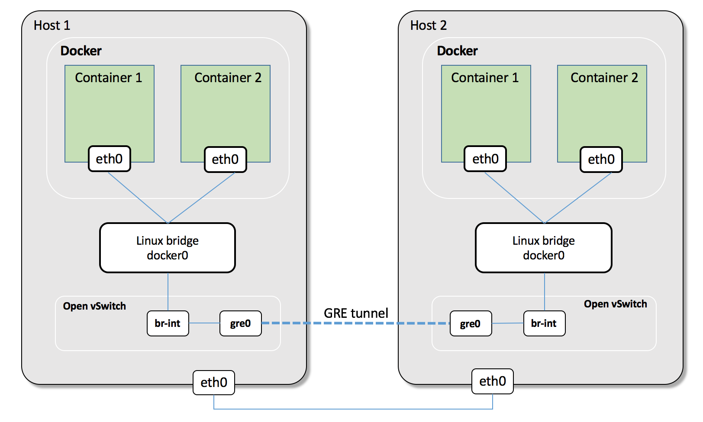

Multi-Host Overlay Networking with Open vSwitch
===============================================

.. note::

    Using OVS is not a good choice, because there are many problems need to resolve, like IP management, external routing.
    So we do not recommand this solution.

This lab will show multi-host network, let's see how containers in different hosts can communicate with each other.

There are at least two ways connect containers with open vSwitch.

- connect default docker0 with ovs bridge
- connect container with ovs bridge directly through veth pair.

We will chose the first way, becuase it's easier. For the second way, if don't use the default docker0 bridge, we will need to do
more work toconnect containers with ovs, such as create network namespace and veth pair manully, attach veth to container, resolve
ip address management, NAT, etc.

Topology
--------

containers connect with docker0 bridge
--------------------------------------

Start a container on host 2

.. code-block:: bash

    ubuntu@docker-node2:~$ docker run -d --name container1 centos:7 /bin/bash -c "while true; do sleep 3600; done"
    98ddd33b16ed5206615aa6bd8e930b359a877794dffe921ee20f0c4b000a440a
    ubuntu@docker-node2:~$
    ubuntu@docker-node2:~$ docker inspect --format '{{.NetworkSettings.IPAddress}}' container1
    172.17.0.2

Start two containers on host 1

.. code-block:: bash

    ubuntu@docker-node1:~$ docker run -d --name container1 centos:7 /bin/bash -c "while true; do sleep 3600; done"
    31109d970148d710c3465af86ec3fb14229c1660640ae56c5b18435286168824
    ubuntu@docker-node1:~$ docker run -d --name container2 centos:7 /bin/bash -c "while true; do sleep 3600; done"
    fdf1cebdd9a5264e18337ea3569a081c59e5e27e2219184557e44921faa63822
    ubuntu@docker-node1:~$
    ubuntu@docker-node1:~$ docker inspect --format '{{.NetworkSettings.IPAddress}}' container1
    172.17.0.2
    ubuntu@docker-node1:~$ docker inspect --format '{{.NetworkSettings.IPAddress}}' container2
    172.17.0.3
    ubuntu@docker-node1:~$

Stop container 1 on host 1, because it has them same IP address as container 1 on host 2

.. code-block:: bash

    ubuntu@docker-node1:~$ docker stop container1
    container1

container 2 on host 1 can not access container 1 on host 2

.. code-block:: bash

    ubuntu@docker-node1:~$ docker exec -it container2 bash
    [root@fdf1cebdd9a5 /]# ping 172.17.0.2
    PING 172.17.0.2 (172.17.0.2) 56(84) bytes of data.
    ^C
    --- 172.17.0.2 ping statistics ---
    18 packets transmitted, 0 received, 100% packet loss, time 17033ms

    [root@fdf1cebdd9a5 /]#

Configure OVS
--------------

Install OVS:

.. code-block:: bash

  $ sudo apt-get install -y openvswitch-switch openvswitch-common

Host 1
~~~~~~~

Create a ovs bridge and a veth pair

.. code-block:: bash

    ubuntu@docker-node1:~$ sudo ovs-vsctl add-br br-int
    ubuntu@docker-node1:~$ sudo ovs-vsctl show
    9e5ebe46-02bf-4899-badd-7aa10245afcb
        Bridge br-int
            Port br-int
                Interface br-int
                    type: internal
        ovs_version: "2.5.0"
    ubuntu@docker-node1:~$
    ubuntu@docker-node1:~$ sudo ip link add veth0 type veth peer name veth1

Connect veth pair with ``dockre0`` and ovs bridge ``br-int``, set them up.

.. code-block:: bash

    ubuntu@docker-node1:~$ sudo ovs-vsctl add-port br-int veth1
    ubuntu@docker-node1:~$ sudo brctl addif docker0 veth0
    ubuntu@docker-node1:~$ sudo ip link set veth1 up
    ubuntu@docker-node1:~$ sudo ip link set veth0 up
    ubuntu@docker-node1:~$ ip link
    1: lo: <LOOPBACK,UP,LOWER_UP> mtu 65536 qdisc noqueue state UNKNOWN mode DEFAULT group default qlen 1
        link/loopback 00:00:00:00:00:00 brd 00:00:00:00:00:00
    2: enp0s3: <BROADCAST,MULTICAST,UP,LOWER_UP> mtu 1500 qdisc pfifo_fast state UP mode DEFAULT group default qlen 1000
        link/ether 02:57:5b:96:48:35 brd ff:ff:ff:ff:ff:ff
    3: enp0s8: <BROADCAST,MULTICAST,UP,LOWER_UP> mtu 1500 qdisc pfifo_fast state UP mode DEFAULT group default qlen 1000
        link/ether 08:00:27:c3:54:4f brd ff:ff:ff:ff:ff:ff
    4: docker0: <BROADCAST,MULTICAST,UP,LOWER_UP> mtu 1500 qdisc noqueue state UP mode DEFAULT group default
        link/ether 02:42:23:8f:ab:da brd ff:ff:ff:ff:ff:ff
    9: ovs-system: <BROADCAST,MULTICAST> mtu 1500 qdisc noop state DOWN mode DEFAULT group default qlen 1
        link/ether 46:eb:b5:81:eb:31 brd ff:ff:ff:ff:ff:ff
    10: br-int: <BROADCAST,MULTICAST> mtu 1500 qdisc noop state DOWN mode DEFAULT group default qlen 1
        link/ether 42:a0:96:7b:e9:42 brd ff:ff:ff:ff:ff:ff
    11: veth1@veth0: <BROADCAST,MULTICAST,UP,LOWER_UP> mtu 1500 qdisc noqueue master ovs-system state UP mode DEFAULT group default qlen 1000
        link/ether 2a:8a:93:9d:b2:b4 brd ff:ff:ff:ff:ff:ff
    12: veth0@veth1: <BROADCAST,MULTICAST,UP,LOWER_UP> mtu 1500 qdisc noqueue master docker0 state UP mode DEFAULT group default qlen 1000
        link/ether ae:16:a0:03:12:4e brd ff:ff:ff:ff:ff:ff

Host 2
~~~~~~~

Almost do the same thing on host 2.

.. code-block:: bash

    ubuntu@docker-node2:~$ ovs-vsctl add-br br-int
    ubuntu@docker-node2:~$ sudo ip link add veth0 type veth peer name veth1
    ubuntu@docker-node2:~$ sudo ovs-vsctl add-port br-int veth1
    ubuntu@docker-node2:~$ sudo brctl addif docker0 veth0
    ubuntu@docker-node2:~$ sudo ip link set veth1 up
    ubuntu@docker-node2:~$ sudo ip link set veth0 up

GRE tunnel between host 1 and host 2
~~~~~~~~~~~~~~~~~~~~~~~~~~~~~~~~~~~~~

on host 1

.. code-block:: bash

    ubuntu@docker-node1:~$ sudo ovs-vsctl add-port br-int gre0 -- \
    set interface gre0 type=gre options:remote_ip=192.168.205.11

on host 1

.. code-block:: bash

    ubuntu@docker-node2:~$ sudo ovs-vsctl add-port br-int gre0 -- \
    set interface gre0 type=gre options:remote_ip=192.168.205.10

The connection between ovs bridge and docker0 bridge

.. code-block:: bash

    ubuntu@docker-node1:~$ sudo ovs-vsctl show
    9e5ebe46-02bf-4899-badd-7aa10245afcb
        Bridge br-int
            Port "veth1"
                Interface "veth1"
            Port br-int
                Interface br-int
                    type: internal
            Port "gre0"
                Interface "gre0"
                    type: gre
                    options: {remote_ip="192.168.205.11"}
        ovs_version: "2.5.0"
    ubuntu@docker-node1:~$ brctl show
    bridge name	bridge id		STP enabled	interfaces
    docker0		8000.0242238fabda	no		veth0
    							vethd5c0abe
    ubuntu@docker-node1:~$

Check GRE tunnel connection
----------------------------

in container1 on host 2 ping container 2 on host 1

.. code-block:: bash

    ubuntu@docker-node2:~$ docker exec -it container1 bash
    [root@98ddd33b16ed /]# ping 172.17.0.3
    PING 172.17.0.3 (172.17.0.3) 56(84) bytes of data.
    64 bytes from 172.17.0.3: icmp_seq=1 ttl=64 time=1.19 ms
    64 bytes from 172.17.0.3: icmp_seq=2 ttl=64 time=0.624 ms
    64 bytes from 172.17.0.3: icmp_seq=3 ttl=64 time=0.571 ms
    ^C
    --- 172.17.0.3 ping statistics ---
    3 packets transmitted, 3 received, 0% packet loss, time 2002ms
    rtt min/avg/max/mdev = 0.571/0.797/1.198/0.285 ms
    [root@98ddd33b16ed /]#

At the same time, start ``tcpdump`` on host 1 and capture packges on the GRE source interface.

.. code-block:: bash

    ubuntu@docker-node1:~$ sudo tcpdump -n -i enp0s8 proto gre
    tcpdump: verbose output suppressed, use -v or -vv for full protocol decode
    listening on enp0s8, link-type EN10MB (Ethernet), capture size 262144 bytes
    14:12:17.966149 IP 192.168.205.11 > 192.168.205.10: GREv0, length 102: IP 172.17.0.2 > 172.17.0.3: ICMP echo request, id 23, seq 1, length 64
    14:12:17.966843 IP 192.168.205.10 > 192.168.205.11: GREv0, length 102: IP 172.17.0.3 > 172.17.0.2: ICMP echo reply, id 23, seq 1, length 64
    14:12:18.967513 IP 192.168.205.11 > 192.168.205.10: GREv0, length 102: IP 172.17.0.2 > 172.17.0.3: ICMP echo request, id 23, seq 2, length 64
    14:12:18.967658 IP 192.168.205.10 > 192.168.205.11: GREv0, length 102: IP 172.17.0.3 > 172.17.0.2: ICMP echo reply, id 23, seq 2, length 64
    14:12:19.968683 IP 192.168.205.11 > 192.168.205.10: GREv0, length 102: IP 172.17.0.2 > 172.17.0.3: ICMP echo request, id 23, seq 3, length 64
    14:12:19.968814 IP 192.168.205.10 > 192.168.205.11: GREv0, length 102: IP 172.17.0.3 > 172.17.0.2: ICMP echo reply, id 23, seq 3, length 64
    14:12:22.982906 ARP, Request who-has 192.168.205.11 tell 192.168.205.10, length 28
    14:12:22.983262 ARP, Reply 192.168.205.11 is-at 08:00:27:b8:22:30 (oui Unknown), length 46

Improvement
-----------

There are some improvements can be done for this lab:

- Create a new docket network instead of using the default docker0 bridge
- docker bridge on host 1 and host 1 have different network ip range for containers
