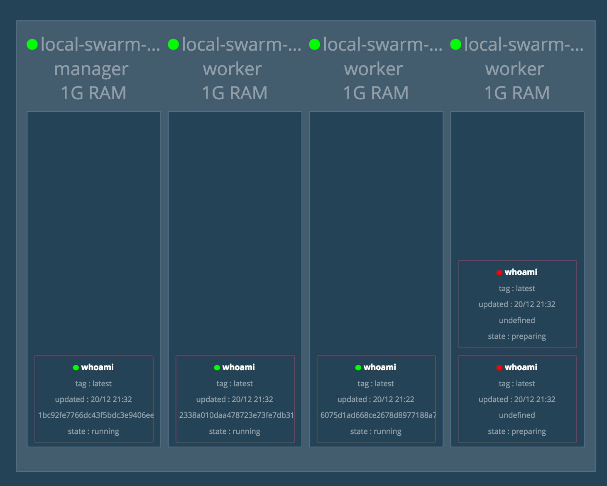

Docker Swarm with Load Balancing and Scaling
============================================

Create a Swarm Cluster
----------------------

Reference :doc:`docker-swarm` to create a swarm cluster which has four node (one manger node and three worker node).

.. code-block:: bash

  ➜  ~ docker-machine ls
  NAME                  ACTIVE   DRIVER       STATE     URL                         SWARM   DOCKER    ERRORS
  local-swarm-manager   -        virtualbox   Running   tcp://192.168.99.100:2376           v1.12.5
  local-swarm-worker1   -        virtualbox   Running   tcp://192.168.99.101:2376           v1.12.5
  local-swarm-worker2   -        virtualbox   Running   tcp://192.168.99.102:2376           v1.12.5
  local-swarm-worker3   -        virtualbox   Running   tcp://192.168.99.103:2376           v1.12.5
  ➜  ~ docker-machine ssh local-swarm-manager
  docker@local-swarm-manager:~$ docker node ls
  ID                           HOSTNAME             STATUS  AVAILABILITY  MANAGER STATUS
  3oseehppjrgkslxug746bfzvg    local-swarm-worker2  Ready   Active
  4wi3zg11lghywrz3c3lph5929    local-swarm-worker3  Ready   Active
  64m0c4gyewt7si74idd2lbi16    local-swarm-worker1  Ready   Active
  9r994lgqivf2dr0v02np63co3 *  local-swarm-manager  Ready   Active        Leader
  docker@local-swarm-manager:~$

Create a Service
----------------

Create a service with cmd ``docker service create``.

.. code-block:: bash

  docker@local-swarm-manager:~$ docker service create --replicas 1 --name helloworld --publish 80:8000 jwilder/whoami
  docker@local-swarm-manager:~$ docker service ls
  ID            NAME        REPLICAS  IMAGE           COMMAND
  4issxzw4mknz  helloworld  1/1       jwilder/whoami
  docker@local-swarm-manager:~$ docker service ps helloworld
  ID                         NAME          IMAGE           NODE                 DESIRED STATE  CURRENT STATE            ERROR
  4m3bbm16oqqw0tafznii7cell  helloworld.2  jwilder/whoami  local-swarm-worker2  Running        Running 8 minutes ago
  docker@local-swarm-manager:~$

We use docker image ``jwilder/whoami`` [#f1]_ which is a simple HTTP docker service that return it's container ID.
It will export port 8000 by default, we use ``--publish 80:8000`` to publish its http port to 80.

It will return the container host name when we use curl to access the service like:

.. code-block:: bash

  docker@local-swarm-manager:~$ curl 127.0.0.1
  I\'m 6075d1ad668c
  docker@local-swarm-manager:~$

Scale a Service
---------------

Use command ``docker service scale`` to scale a service.

.. code-block:: bash

  docker@local-swarm-manager:~$ docker service ps helloworld
  ID                         NAME              IMAGE           NODE                 DESIRED STATE  CURRENT STATE                 ERROR
  9azr7sushz03hmequqw24o9kf  helloworld.1      jwilder/whoami  local-swarm-worker3  Running        Preparing about a minute ago
  4m3bbm16oqqw0tafznii7cell  helloworld.2      jwilder/whoami  local-swarm-worker2  Running        Running 10 minutes ago
  eoiym8q7gqpwg1o6k0oys9bod  helloworld.3      jwilder/whoami  local-swarm-worker1  Running        Running 59 seconds ago
  2klxh8c8m3m8jctmqclnj8awg  helloworld.4      jwilder/whoami  local-swarm-manager  Running        Running 59 seconds ago
  dopnnfmpfqgvhwvel42vl2yw5  helloworld.5      jwilder/whoami  local-swarm-worker3  Running        Preparing about a minute ago
  docker@local-swarm-manager:~$ docker service ls
  ID            NAME        REPLICAS  IMAGE           COMMAND
  4issxzw4mknz  helloworld  3/5       jwilder/whoami

There are four helloworld replicas, and two of them are preparing because it need download the docker image.

We can use ``curl`` to test it again.

.. code-block:: bash

  docker@local-swarm-manager:~$ for i in `seq 4`; do curl 127.0.0.1; done
  I\'m 2338a010daa4
  I\'m 1bc92fe7766d
  I\'m 6075d1ad668c
  I\'m 2338a010daa4
  docker@local-swarm-manager:~$

it's load balancing!

Visualization Swarm Cluster
---------------------------

There is a visualizer for Docker Swarm Mode using the Docker Remote API, Node.JS, and D3 [#f2]_. Start it on the manager node,
then through web browser, we can get the picture like:

Reference
---------

.. [#f1] https://github.com/jwilder/whoami
.. [#f2] https://github.com/ManoMarks/docker-swarm-visualizer
